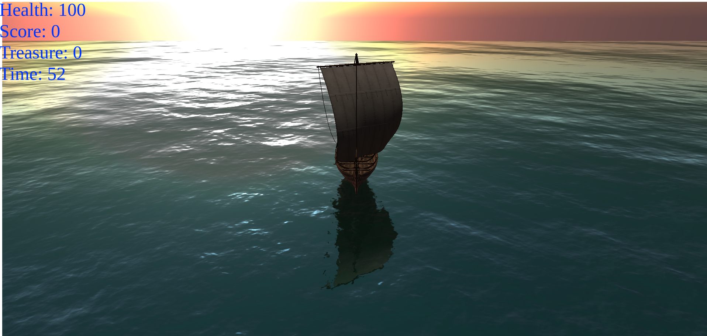

# BATTLESHIP


# SETUP
* Clone the repository 
* Change working directory to current directory 
```
$ cd BATTLESHIP
```
* Run the following commnad to install ```http-server```
```
npm i http-server
```
* Run the following command to start the server
```
http-server
```
* Open browser and navigate to ```http://localhost:8080/``` to play the game
